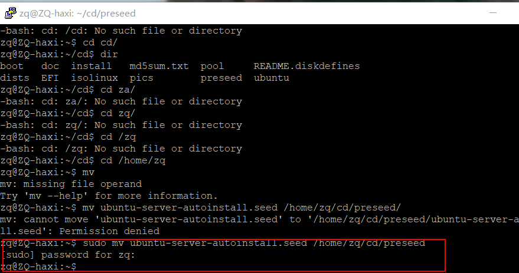
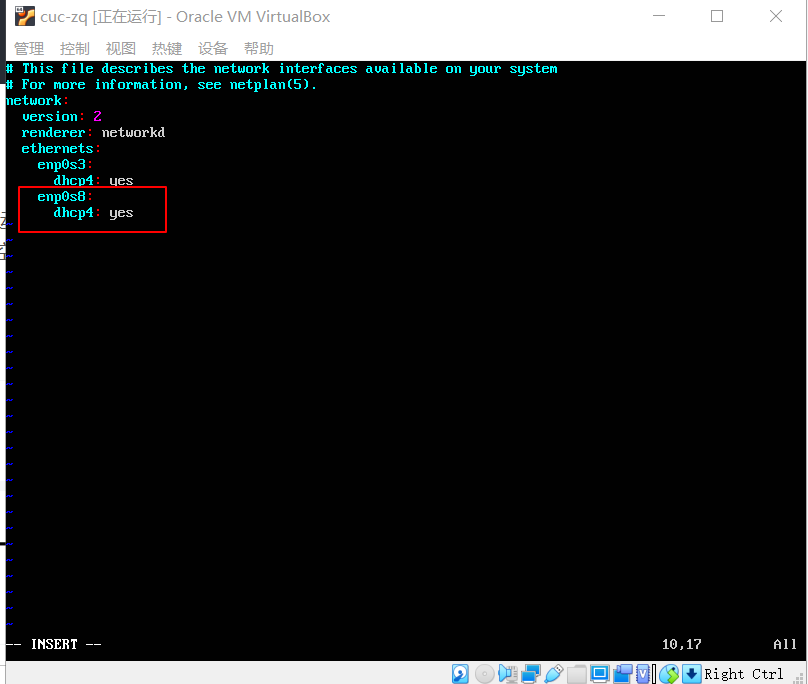

# 实验一：Linux基础

## 实验问题：

- 如何配置无人值守安装iso并在Virtualbox中完成自动化安装。
- Virtualbox安装完Ubuntu之后新添加的网卡如何实现系统开机自动启用和自动获取IP？

- 如何使用sftp在虚拟机和宿主机之间传输文件？

### 1.无人值守安装iso

```
# 根据实际情况，自行替换其中的参数
# 在当前用户目录下创建一个用于挂载iso镜像文件的目录
mkdir loopdir

# 挂载iso镜像文件到该目录
mount -o loop ubuntu-16.04.1-server-amd64.iso loopdir
```


- 错误：挂载文件失败
- 解决：应该将iso文件传输到虚拟机中

**Putty进行连接：**


- 用psftp将ubuntu-18.04.4-server-amd64.iso传入虚拟机中
  


- 挂载成功


```
# 创建一个工作目录用于克隆光盘内容
mkdir cd
 
# 同步光盘内容到目标工作目录
# 一定要注意loopdir后的这个/，cd后面不能有/
rsync -av loopdir/ cd

# 卸载iso镜像
umount loopdir
```


*注：当权限不够时，在前面加上sudo*

```
# 进入目标工作目录
cd cd/

# 编辑Ubuntu安装引导界面增加一个新菜单项入口
vim isolinux/txt.cfg
```
添加以下内容到该文件后强制保存退出
```
label autoinstall
  menu label ^Auto Install Ubuntu Server
  kernel /install/vmlinuz
  append  file=/cdrom/preseed/ubuntu-server-autoinstall.seed debian-installer/locale=en_US console-setup/layoutcode=us keyboard-configuration/layoutcode=us console-setup/ask_detect=false localechooser/translation/warn-light=true localechooser/translation/warn-severe=true initrd=/install/initrd.gz root=/dev/ram rw quiet
  ```


- 一定要添加到文件头处，否则会无效，最后会报错。

- :wq！强制保存退出vim编辑器

**将定制的ubuntu-server-autoinstall.seed保存到~/cd/preseed/**

- 用psftp将文件存到虚拟机中


- 用mv命令将.seed 保存至~/cd/preseed/ubuntu-server-autoinstall.seed



- 修改isolinux/isolinux.cfg，增加内容timeout 10（可选，否则需要手动按下ENTER启动安装界面）


```
# 重新生成md5sum.txt
cd ~/cd && find . -type f -print0 | xargs -0 md5sum > md5sum.txt

# 封闭改动后的目录到.iso
IMAGE=custom.iso
BUILD=~/cd/

mkisofs -r -V "Custom Ubuntu Install CD" \
            -cache-inodes \
            -J -l -b isolinux/isolinux.bin \
            -c isolinux/boot.cat -no-emul-boot \
            -boot-load-size 4 -boot-info-table \
            -o $IMAGE $BUILD

# 如果目标磁盘之前有数据，则在安装过程中会在分区检测环节出现人机交互对话框需要人工选择
```
- 重新生成md5sum.txt


*md5sum.txt没有权限，用chmod 777 md5sum.txt赋予权限*

- 封闭改动后的目录到.iso


- 通过sftp将custom.iso下载到本地

- 安装成功


## 2.新添网卡自动获取IP


- 新添网卡后未设置前


- sudo vi /etc/netplan/01-netcfg-init.yaml，配置文件



- 配置后，```sudo netplan apply ```让配置直接生效


## 3.用sftp在虚拟机和宿主机之间传输文件

- open [ip地址] 命令：打开登陆虚拟机，使宿主机与其相连

- put命令：从本地上传文件到虚拟机

- get命令：从虚拟机保存文件到本地

（具体实现见上无人值守配置操作过程）

## 遇到的问题
- 用户权限问题   解决：在命令前加sudo
- md5sum.txt没有权限  解决：使用chmod 777 md5sum.txt赋予权限

- 封闭改动后的目录到.iso时，‘mkisofs’ not found 。解决：```sudo apt install genisoimage```
- 配置完的iso，启动后出现failed to load ldlinux.c32 解决：将内容强制保存到isolinux/txt.cfg文件头后启动，没有出现这个错误。

## 参考资料

[往届学生实验](https://github.com/CUCCS/2015-linux-public-ghan3/blob/master/%E7%AC%AC%E4%B8%80%E7%AB%A0%EF%BC%9ALinux%E5%9F%BA%E7%A1%80%EF%BC%88%E5%AE%9E%E9%AA%8C%EF%BC%89/hw1.md)

[自动获取IP地址](https://blog.csdn.net/liuhaoy/article/details/101078932?depth_1-utm_source=distribute.pc_relevant.none-task&utm_source=distribute.pc_relevant.none-task)
