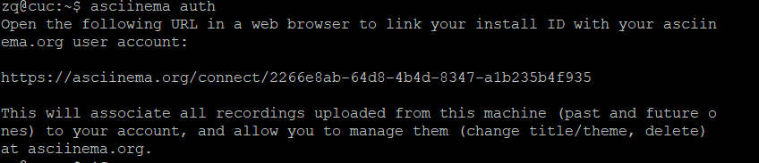

# 实验二：vimtutor学习


## 一：安装asciinema

- 官方安装步骤：
```json
sudo apt-add-repository ppa:zanchey/asciinema
sudo apt-get update
sudo apt-get install asciinema
```
- 在asciinema成功关联了本地账号和在线账号
  
```json
asciinema auth
```



## 二：完成VIMTUTOR

[asciinema录屏](https://asciinema.org/a/r5B2tsqOtuniYiRSYQg51JhVV)


## 三：VIMTUTOR完成后的自查清单

- **你了解vim有哪几种工作模式？**
  
  1.Normal正常模式：```<Esc>```转换到Normal模式

  2.Insert插入模式：```i/o/a/A```进入insert模式

  3.命令模式：按下```:```

  4.visual模式：按下```v```
- **Normal模式下，从当前行开始，一次向下移动光标10行的操作方法？如何快速移动到文件开始行和结束行？如何快速跳转到文件中的第N行？**
 
  * 一次向下移动光标10行：```10j```
  * 快速移动到开始行：```gg```
  * 快速移动到结束行：```G```
  * 快速跳转到文件的第N行：```NG```先按下第N行的数字再按G
- **Normal模式下，如何删除单个字符、单个单词、从当前光标位置一直删除到行尾、单行、当前行开始向下数N行？**
  * 删除单个字符：```x```
  * 删除单个单词：```dw```
  * 从当前光标位置删除到行尾：```d$```
  * 删除到单行：```dd```
  * 删除当前行开始下数N行：```Ndd```
  
- **如何在vim中快速插入N个空行？如何在vim中快速输入80个-？**
  
  * 插入N个空行：```No```
  * 输入80个-:```80i-```
- **如何撤销最近一次编辑操作？如何重做最近一次被撤销的操作？**
  
  * 撤销最近一次操作：```u```
  * 重做最近一次被撤销的操作：```Ctrl-R```
- **vim中如何实现剪切粘贴单个字符？单个单词？单行？如何实现相似的复制粘贴操作呢？**
  
  * 剪切粘贴：单个字符```d p``` 单个单词```dw p``` 单行```dd p```
  * 复制粘贴：在visual模式下，选中内容,按```y```复制，按```p```粘贴。
- **为了编辑一段文本你能想到哪几种操作方式（按键序列）？**
  
  1.```vim+文件名```
  
  2.```i```进入编辑模式

  3.```Esc```退出编辑

  4.```:wq```保存退出
- **查看当前正在编辑的文件名的方法？查看当前光标所在行的行号的方法？**
  
  * ```Ctrl-G```
  
- **在文件中进行关键词搜索你会哪些方法？如何设置忽略大小写的情况下进行匹配搜索？如何将匹配的搜索结果进行高亮显示？如何对匹配到的关键词进行批量替换？**
  
  * 关键词搜索：```/```word或```?```word
  * 忽略大小写进行匹配搜索：```set ic```
  * 进行高亮显示：```set hls is```
  * 进行批量替换：```s/old/new/g ```:批量替换一行 ```%s/old/new/g```:批量替换整个文本
  
- **在文件中最近编辑过的位置来回快速跳转的方法？**
  
  * ```Ctrl-o```
  * ```Ctrl-i```
- **如何把光标定位到各种括号的匹配项？例如：找到(, [, or {对应匹配的),], or }**
  
  * 光标将移动到匹配的括号，按下```%```
- **在不退出vim的情况下执行一个外部程序的方法？**
  
  * ```:!+命令```
- **如何使用vim的内置帮助系统来查询一个内置默认快捷键的使用方法？如何在两个不同的分屏窗口中移动光标？**
  
  * 内置帮助系统 ：```:help ```
  * 不同分屏移到光标：```Ctrl-W```


## 参考资料

https://asciinema.org/docs/installation

https://asciinema.org/docs/getting-started