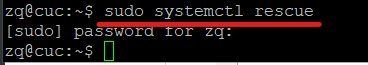
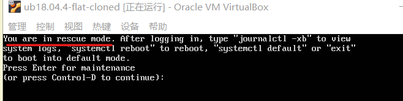
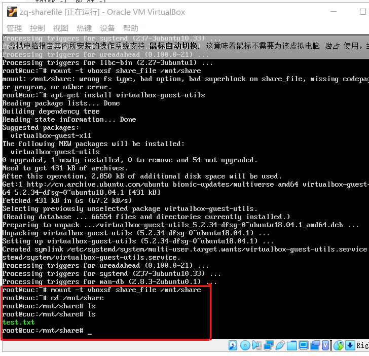
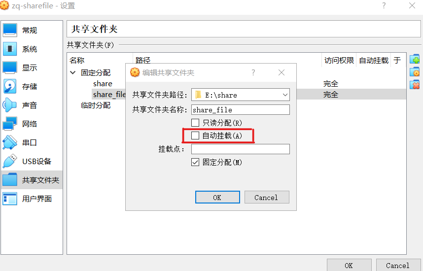

# 实验三：动手实战Systemd

## 一、命令篇

**1.系统管理**
  - **systemctl**
    * 有些命令无法录屏，个别命令采用图片方式显示。
    * 重启系统、关闭系统，切断电源、CPU停止工作、暂停系统、让系统进入冬眠状态、让系统进入交互式休眠状态。
    * 启动进入救援状态（单用户状态）
  
  

- systemd-analyze+hostnamectl+localectl+timedatectl+loginctl

   [系统管理录屏](https://asciinema.org/a/b8V0DtHWlVgYfUQBSBAVi0eg6)


**2.Unit**

[Unit录屏](https://asciinema.org/a/JVwmNc8utWEbWD4PvU7ilHEaZ)

**3.Unit配置文件**

[Unit的配置文件录屏]( https://asciinema.org/a/4FACIlROt4sSeNC0uQC5g7MS2)

**4.Target**

[Target录屏]( https://asciinema.org/a/S8SW5IfIB1f3K5uAnRwJE334k)

**5.日志管理**（journalctl）

[日志管理录屏](https://asciinema.org/a/08EYVtb0J9U6nChfI7esSGc0p)

## 二、实践篇

[实践篇录屏](https://asciinema.org/a/3V6W91bN27wWgNlRMMtOTHpVU)

## 三、自查清单

* 如何添加一个用户并使其具备sudo执行程序的权限？
  
  ``` json
    #如果不是root用户先切换到root
    sudo su

    #添加用户
    adduser username

    #使其具备sudo执行权限
    sudo usermod -a -G sudo username

  ```

* 如何将一个用户添加到一个用户组
  ```
  sudo usermod -a -G groupname username

  ```
* 如何查看当前系统的分区表和文件系统详细信息？
   ```
   fdisk -l  或 df -T
   ```
* 如何实现开机自动挂载Virtuallbox的目录分区？

    ```json
    #安装增强功能，得到VBoxGuestAdditions.iso将其挂载
    cd /media
    mkdir vbox
    sudo mount /dev/sr0 vbox/
    sh ./VBoxLinuxAdditions.run

    #设置虚拟机里面的共享文件夹的挂载路径
    mkdir /mnt/share
    #share_file指的是共享文件的名字
    mount -t vboxsf share_file /mnt/share
    ```
    

    * 自动挂载
    

    * 遇到的错误：
    在执行```mount -t vboxsf share_file /mnt/share```出现wrong fs type, bad option, bad superblock on.....
    
    * 解决：首先使用```sudo apt install nfs-common```安装帮助程序，仍出错。
    后因为是在vritualbox搭建的环境，使用```sudo apt-get install virtualbox-guest-utils```问题解决。

* 基于LVM（逻辑分卷管理）的分区如何实现动态扩容和缩减容量？
  
  * 扩容 ```sudo lvextend -L +1G LVpath[LV的路径]```
  * 缩减容量```sudo lvextend -L -1G LVpath[LV的路径]```
* 如何通过systemd设置实现在网络连通时运行一个指定脚本，在网络断开时运行另一个脚本？
    在networking.service配置文件中添加
    ```
    [Service]
    ExecStart='脚本地址'
    ExecStop='脚本地址'
    ```
* 如何通过systemd设置实现一个脚本在任何情况下被杀死之后会立即重新启动？实现杀不死？
  
  向配置文件里添加```Restart=always```