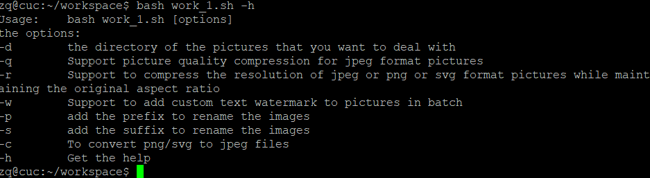
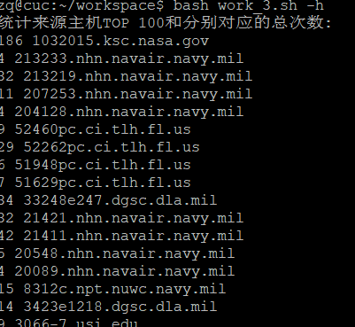

# 第四章：shell脚本编程基础（实验）

## 任务一：用bash编写一个图片批处理脚本

  **使用imagemagick工具** ```sudo apt-get imagemagick```
- 支持命令行参数方式使用不同功能
- 支持对指定目录下所有支持格式的图片文件进行批处理
- 支持以下常见图片批处理功能的单独使用或组合使用
  

**帮助文档**：




  - 支持对jpeg格式图片进行图片质量压缩

    图片压缩之前：```find test | xargs -i identify {}```

    

    压缩：```bash work_1.sh -d test/-q 30```

    

    图片压缩之后：```find output | xargs -i identify {}```

    


  - 支持对jpeg/png/svg格式图片在保持原始宽高比的前提下压缩分辨率

    压缩前：

    

    压缩：```bash work_1.sh -d test/ -r 100```

    

    压缩后：

    

    *压缩后svg格式图片有损坏，尚未解决*

  - 支持对图片批量添加自定义文本水印

    ```bash work_1.sh -d test/ -w cuc```
    
    
  - 支持批量重命名（统一添加文件名前缀或后缀，不影响原始文件扩展名）

    - 加前缀 ```bash work_1.sh -d test/ -p cuc```

      

    - 加后缀 ```bash work_1.sh -d test/ -s cuc```

      
  - 支持将png/svg图片统一转换为jpg格式图片

    


## 任务二：用bash编写一个文本批处理脚本，对以下附件分别进行批量处理完成相应的数据统计任务：

### 2014世界杯运动员数据
  
  帮助文档
  

- 统计不同年龄区间范围（20岁以下、[20-30]、30岁以上）的球员数量、百分比
  
  

- 统计不同场上位置的球员数量、百分比
  
  

- 名字最长的球员是谁？名字最短的球员是谁？
  
  

- 年龄最大的球员是谁？年龄最小的球员是谁？
  
  


### Web服务器访问日志

帮助文档：


- 统计访问来源主机TOP 100和分别对应出现的总次数
  
  - 详细数据见 [host.txt](data/host.txt)
  
  


- 统计访问来源主机TOP 100 IP和分别对应出现的总次数
  
  - 详细数据见 [ip.txt](data/ip.txt)
    
    

- 统计最频繁被访问的URL TOP 100
  
  - 详细数据见 [url.txt](data/url.txt)
    
    

- 统计不同响应状态码的出现次数和对应百分比
  
  

- 分别统计不同4XX状态码对应的TOP 10 URL和对应出现的总次数
  
  

- 给定URL输出TOP 100访问来源主机

  - 详细数据见 [url_host.txt](data/url_host.txt)

    


## 参考资料

[imagemagick 介绍及案例](https://aotu.io/notes/2018/06/06/ImageMagick_intro/index.html)

[imagemagick 官网](https://imagemagick.org/index.php)

[awk命令解析](https://www.cnblogs.com/ggjucheng/archive/2013/01/13/2858470.html)

[同学实验](https://github.com/CUCCS/2015-linux-public-JuliBeacon/tree/524f60f68f2315623231db132df03313ab3df72a/%E5%AE%9E%E9%AA%8C%204)

[同学实验](https://github.com/FitzBC/linux/tree/0636a22f94a388f3869d799cdc7c22cd693ed214/2017-1/FitzBC/%E5%AE%9E%E9%AA%8C4)