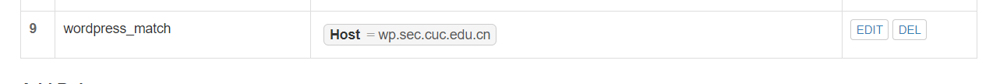
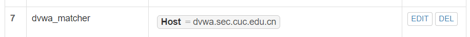
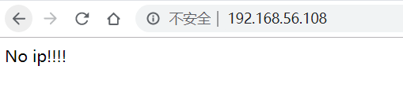

# Web服务器（实验）

## 1.实验环境

  Ubuntu 18.04

  Nignx

  VeryNginx

  Wordpress 4.7

  Damn Vulnerable Web Application(DVWA)

  **修改win10主机的hosts文件：**
  
  


## 2.安装Nginx

- 使用```sudo apt-get install nginx```命令安装。
  
  

## 3.安装VeryNginx

  ```shell
  #先关掉nginx
  sudo nginx -s stop

  #添加组件
  sudo apt install libpcre3 libpcre3-dev
  sudo apt install openssl libssl1.0-dev
  sudo apt install zlib1g-dev
  sudo apt install python3
  sudo apt install gcc
  sudo apt install make
  # 下载并解压verynginx安装包
  wget https://github.com/alexazhou/VeryNginx/archive/master.zip
  unzip master.zip
  cd VeryNginx-master/
  #安装
  sudo python3 install.py install
  ```
  - 进入 ```cd /opt/verynginx/openresty/nginx/conf/```修改```nginx.conf```配置文件，将user改为默认的www-data用户。
  - 启动```/opt/verynginx/openresty/nginx/sbin/nginx```
  - 访问http://192.168.56.108/verynginx/index.html网址
  
    
    
    

  ## 4.安装wordpress

  - 安装mysql

    - 安装mysql:```sudo apt install mysql-server```
    - 创建独立数据库 ：
    
      ```sql
      mysql -u root -p
      mysql> CREATE USER 'wordpress'@'localhost' IDENTIFIED BY 'wordpress';
      mysql> CREATE DATABASE wp_db;
      mysql> GRANT ALL ON wp_db.* TO 'wordpress'@'localhost';
      ```
    - 刷新：```FLUSH PRIVILEGES;```
    - 退出：```EXIT;```
  - 安装php扩展

      ```sh
     sudo apt install -y  php7.2-fpm php7.2-mysql php7.2-gd
      ```
    
  - 下载安装wordpress
    ```shell
    # 指定WorePress目录
    WP_PATH=/var/www/wordpress
    # 创建该目录下的public文件夹
    sudo mkdir -p ${WP_PATH}/public/
    # 修改该文件下的所有者为www-data
    sudo chown -R www-data:www-data ${WP_PATH}/public
    # 下载并解压WorePress
    wget https://wordpress.org/wordpress-4.7.zip
    unzip wordpress-4.7.zip
    # 将wordpress文件全部拷贝刚才的public中
    sudo cp -r wordpress/* ${WP_PATH}/public/
    cd ${WP_PATH}/public/
    # 拷贝配置文件
    sudo cp wp-config-sample.php wp-config.php
    # 修改wp-config.php文件中的`database_name_here`,`username_here`和`password_here`字段为我们的数据库名称，用户名和密码。使wordpress能够访问mysql。
    sudo sed -i s/database_name_here/wp_db/ wp-config.php
    sudo sed -i s/username_here/wordpress/ wp-config.php
    sudo sed -i s/password_here/wordpress/ wp-config.php
    ```
## 5.连接WordPress与Nginx
```shell
# 新建配置文件，设置端口8080和文件名wp.sec.cuc.edu.cn
WP_DOMAIN=wp.sec.cuc.edu.cn
WP_PORT=8080
sudo tee /etc/nginx/sites-available/${WP_DOMAIN} << EOF
server {
    listen localhost:${WP_PORT};
    server_name ${WP_DOMAIN};

    root ${WP_PATH}/public;
    index index.php;

    location / {
        try_files \$uri \$uri/ /index.php?\$args;
    }

    location ~ \.php\$ {
        include snippets/fastcgi-php.conf;
        fastcgi_pass unix:/run/php/php7.2-fpm.sock;
    }
}
EOF
# 在sites-enabled中创建sites-available的软链接，并删除default
sudo ln -s /etc/nginx/sites-available/${WP_DOMAIN} /etc/nginx/sites-enabled/
sudo rm /etc/nginx/sites-enabled/default
# 启动nginx
sudo nginx
```
## 6.配置verynginx




  - 访问 http://wp.sec.cuc.edu.cn
  
    

  - 配置wordpress初始信息生成网站
  
    

    

## 7.安装Dvwa并配置VeryNginx

- 下载:通过 http://www.dvwa.co.uk/ 下载zip压缩包到本地后，用psftp上传到虚拟机。
- 解压：```unzip DVWA-master.zip```
- ```shell
  # 指定目录，更改所有者
  DVWA_PATH=/var/www/dvwa
  sudo mkdir -p ${DVWA_PATH}/public/
  sudo chown -R www-data:www-data ${DVWA_PATH}/public
  # 拷贝文件到/var/www/dvwa下
  sudo cp -r DVWA-master/* ${DVWA_PATH}/public/
  cd ${DVWA_PATH}/public/
  sudo cp config/config.inc.php.dist config/config.inc.php
  # 配置文件,8000端口
  DVWA_DOMAIN=dvwa.sec.cuc.edu.cn
  DVWA_PORT=8000
  sudo tee /etc/nginx/sites-available/${DVWA_DOMAIN} << EOF
  server {
      listen localhost:${DVWA_PORT};
      server_name ${DVWA_DOMAIN};

      root ${DVWA_PATH}/public;
      index index.php;

     location / {
          try_files \$uri \$uri/ /index.php?\$args;
      }

      location ~ \.php\$ {
          include snippets/fastcgi-php.conf;
          fastcgi_pass unix:/run/php/php7.2-fpm.sock;
      }
  }
  EOF
  # 设置软链接
  sudo ln -s /etc/nginx/sites-available/${DVWA_DOMAIN} /etc/nginx/sites-enabled/
  # 重新载入配置
  sudo nginx -s reload
  ```
- 配置VeryNginx

  

  .png)

  .png)

- 访问 http://dvwa.sec.cuc.edu.cn
  
  

## 8.安全加固

- **使用IP地址方式均无法访问上述任意站点，并向访客展示自定义的友好错误提示信息页面-1**
  
  - 添加matcher

  

  - 添加response

  

  - 添加filter
  
  

  - 使用ip无法访问
  
   

- 修改 ```/opt/verynginx/verynginx/configs/config.json```配置文件将enable改为false，但依旧不能重新用ip访问，原因是发现此时端口被占用了，使用```sudo netstat -anp | grep 80```查看端口情况，并结束占用进程，重启verynginx即可重新用ip访问。

- **Damn Vulnerable Web Application (DVWA)只允许白名单上的访客来源IP，其他来源的IP访问均向访客展示自定义的友好错误提示信息页面-2**
  
  - 添加mather

  

  - 添加response
  
  

  - 添加filter

  

  - 在白名单内访问
  
  

  - 不在白名单内

  

- **在不升级Wordpress版本的情况下，通过定制VeryNginx的访问控制策略规则，热修复WordPress < 4.7.1 - Username Enumeration**
  - 漏洞:访问/wp-json/wp/v2/users/可以获取wordpress用户信息
  
  

  

  

  

- **通过配置VeryNginx的Filter规则实现对Damn Vulnerable Web Application (DVWA)的SQL注入实验在低安全等级条件下进行防护**
  
  

  

## 9.VeryNginx配置要求

- **VeryNginx的Web管理页面仅允许白名单上的访客来源IP，其他来源的IP访问均向访客展示自定义的友好错误提示信息页面-3**
  
  

  

  

- **通过定制VeryNginx的访问控制策略规则实现：**

  - 限制DVWA站点的单IP访问速率为每秒请求数 < 50
  - 限制Wordpress站点的单IP访问速率为每秒请求数 < 20

    

    

  - 禁止curl访问
  
    

    

## 参考资料

[How To Install WordPress with LEMP on Ubuntu 18.04](https://www.digitalocean.com/community/tutorials/how-to-install-wordpress-with-lemp-on-ubuntu-18-04#step-1-%E2%80%94-creating-a-mysql-database-and-user-for-wordpress)

[Damn Vulnerable Web Application (DVWA)](http://www.dvwa.co.uk/)

https://github.com/CUCCS/linux-2019-DcmTruman/blob/0x05/0x05/%E5%AE%9E%E9%AA%8C%E6%8A%A5%E5%91%8A.md

https://github.com/CUCCS/linux-2019-FLYFLY-H/blob/linux_exp5/exp5/%E5%AE%9E%E9%AA%8C%E6%8A%A5%E5%91%8A%E4%BA%94.md