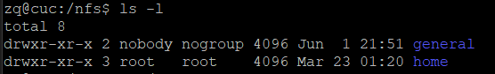

# 实验六：shell脚本编程练习进阶

## 实验环境

- 工作主机

  - ubuntu 18.04 
  - nat网卡和host-only网卡（ 192.168.56.109）
- 目标主机
  
  - Ubuntu 18.04
  - nat网卡和host-only网卡（192.168.56.110）


## 实验过程

- ## FTP

    - 安装proftpd:```sudo apt install proftpd```

    - **配置一个提供匿名访问的FTP服务器，匿名访问者可以访问1个目录且仅拥有该目录及其所有子目录的只读访问权限；**
    
        修改配置文件proftpd.conf:```sudo vi /etc/proftpd/proftpd.conf```

        

        在home下创建ftp文件夹
        - 修改共享目录 ```sudo chown -R ftp:nogroup /home/ftp
sudo usermod -d /home/ftp ftp```

    - **配置一个支持用户名和密码方式访问的账号，该账号继承匿名访问者所有权限，且拥有对另1个独立目录及其子目录完整读写（包括创建目录、修改文件、删除文件等）权限，（该账号仅可用于FTP服务访问，不能用于系统shell登录**
  
        修改配置文件proftpd.conf 添加以下内容
        ```bash
        AuthOrder mod_auth_file.c mod_auth_unix.c
        AuthUserFile /usr/local/etc/proftpd/passwd
        AuthGroupFile /usr/local/etc/proftpd/group
        PersistentPasswd off
        RequireValidShell off

        ```
         新建passwd和group文件夹

        - 创建user1和user2用户 
            
            ```bash
            sudo ftpasswd --passwd --file=/usr/local/etc/proftpd/passwd --name=user1 --uid=1024 --home=/home/user1 --shell=/bin/false
            ```

            

        - 创建了一个virtualusers组

            ```bash
            sudo ftpasswd --file=/usr/local/etc/proftpd/group   --group --name=virtualusers --gid=1024
            ```
            

        - 把user1和user2加入virtualusers组：
  
            ```bash
            sudo ftpasswd --group --name=virtualusers --gid=1024 --member=user1 --member=user2 --file=/etc/proftpd/group
            ```
            

        修改文件夹权限

        - ```sudo chown -R 1024:1024 /home/user1```
        - ```sudo chmod -R 700 /home/user1```
  
    - **FTP用户不能越权访问指定目录之外的任意其他目录和文件**

        在proftpd.conf配置文件中，添加DefaultRoot ~ 限定用户只能访问自己的目录.
    - **匿名访问权限仅限白名单IP来源用户访问，禁止白名单IP以外的访问**

        在proftpd.conf配置文件中，添加：

        


- ## NFS

    - **在1台Linux上配置NFS服务，另1台电脑上配置NFS客户端挂载2个权限不同的共享目录，分别对应只读访问和读写访问权限.**

        

        server配置(192.168.56.110)

        ```sudo apt install nfs-kernel-server```

        - 创建一个用于挂载的可读写的文件夹

            ```sudo mkdir /var/nfs/general -p```

            ```sudo chown nobody:nogroup /var/nfs/general```
            
            另一个用于挂载的只读文件夹 /home （无需创建）
        - 配置文件 /etc/exports  指定clients ip和权限

            ```
            /var/nfs/general    192.168.56.109(rw,sync,no_subtree_check)
            /home       192.168.56.109(sync,no_root_squash,no_subtree_check)
            ```

        client配置(192.168.56.109)
        
        ```sudo apt install nfs-common```

        - 在Client上创建相应的挂载文件
       
            ```sudo mkdir -p /nfs/general```

            ```sudo mkdir -p /nfs/home```
        - 在Client上挂载文件夹

            ```sudo mount 192.168.56.110:/var/nfs/general /nfs/general```

            ```sudo mount 192.168.56.110:/home /nfs/home```

    - NFS中的文件属主、权限查看

        NFS客户端文件夹的属主、权限信息
        

        NFS只读文件夹的属主、权限信息
        

        NFS读写文件夹的属主、权限信息
        

        在NFS服务器端上查看文件属主、权限信息
        

- ## Samba

   - Server：Linux & Client：Windows

        - 安装``sudo apt install samba``
        - 修改配置文件```sudo vim /etc/samba/smb.conf```

            

        - 创建用户
            ```sudo useradd -M -s /sbin/nologin smbuser```
            ```sudo passwd smbuser```

        - 在linux中添加同名用户```sudo smbpasswd -a smbuser```
        - 使设置的账户生效```sudo smbpasswd -e smbuser```
        - 创建用户组并加入```sudo groupadd smbgroup```
            ```sudo usermod -G smbgroup smbuser```
        - 创建用于共享的文件夹并修改用户组
            ```bash
            sudo mkdir -p /home/samba/guest/
            sudo mkdir -p /home/samba/demo/
            sudo chgrp -R smbgroup /home/samba/guest/
            sudo chgrp -R smbgroup /home/samba/demo/
            sudo chmod 2775 /home/samba/guest/
            sudo chmod 2770 /home/samba/demo/
            ```
        - 启动Samba ```smbd```

        - win10访问共享文件夹

            

- ## DHCP

    - **2台虚拟机使用Internal网络模式连接，其中一台虚拟机上配置DHCP服务，另一台服务器作为DHCP客户端，从该DHCP服务器获取网络地址配置**

        - 修改server配置文件```sudo vim /etc/network/interfaces```

            

        - server端安装需要使用的软件```sudo apt install isc-dhcp-server```

        - 修改server中/etc/default/isc-dhcp-server文件

            INTERFACES="enp0s9"

        - 修改server中/etc/dhcp/dhcpd.conf文件

            ```bash
            subnet 10.0.2.0 netmask 255.255.255.0 {
                range dynamic-bootp 10.0.2.65 10.0.2.100;
                option broadcast-address 10.0.2.255;
                option subnet-mask 255.255.255.0;
                default-lease-time 600;
                max-lease-time 7200;
                }
            ```
        - server端开启 isc-dhcp-server 服务

            ```service isc-dhcp-server restart```

- ## DNS

    - server端

        - 安装bind9```sudo apt install bind9```
        - 修改/etc/bind/named.conf.local文件

            ```bash
            zone "cuc.edu.cn" {
                type master;
                file "/etc/bind/db.cuc.edu.cn"
                };
            ```
        - 创建保存域名解析的db文件```sudo cp /etc/bind/db.local /etc/bind/db.cuc.edu.cn```
        - 编辑/etc/bind/db.cuc.edu.cn文件 添加需要解析的域名
            ```
            wp.sec.cuc.edu.cn       IN      A       10.0.2.15
            dvwa.sec.cuc.edu.cn     IN      CNAME   wp.sec.cuc.edu.cn.
            test.com                IN      A       10.0.2.65
            ```
        - 重启服务 ```service bind9 restart```
    - 客户端配置使用对应的服务器

        ```bash
        #客户端添加解析服务器
        sudo vim /etc/resolvconf/resolv.conf.d/head
	    search cuc.edu.cn
	    nameserver 192.168.254.25

        #更新resolv.conf文件
        sudo apt install resolvconf
        sudo resolvconf -u  
        ```        


## 参考链接


[往届同学实验](https://github.com/CUCCS/linux-2019-jackcily/blob/job6/job6/job6.md)

[Configure DHCP Client : Ubuntu](https://www.server-world.info/en/note?os=Ubuntu_18.04&p=dhcp&f=2)


  


